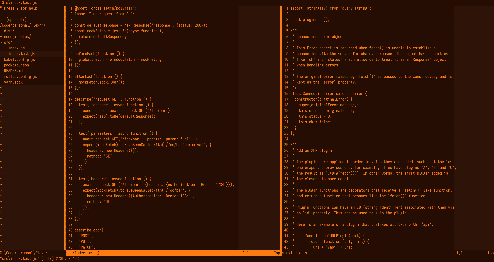

# Vim Amber

This is a theme that simulates the retro PC amber monochrome CRT. It has
pretty much no syntax-specific variations in color and is, instead, focusing
on providing variations for the editor elements themselves (e.g., line
numbers, color column, etc).

This theme can toggle between light and dark mode by setting the `background`
variable to "light" or "dark".

Some tricks and code borrowed from
[Lucius](https://github.com/jonathanfilip/vim-lucius/) theme by Jonathan Filip.

